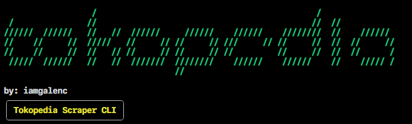
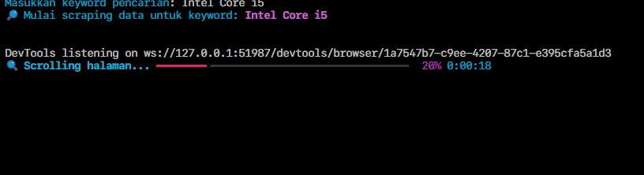
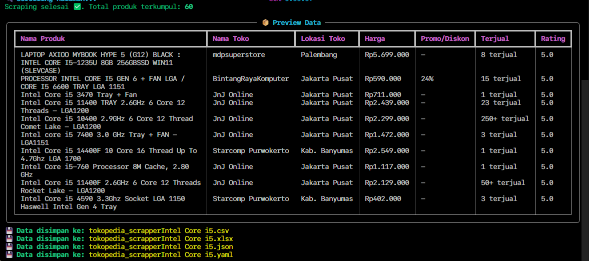
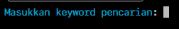

## Tugas E-Commerce 1 (Aryasatya Maheswara Galen Centrino/235091100111004)
Code and Data = (https://github.com/iamgalenc/tokoscrapper)





# TokoScrapper (CLI)
TokoScrapper CLI is a command-line tool to scrape product data from [Tokopedia](https://www.tokopedia.com) using 
**Python, Selenium, BeautifulSoup, and Rich**.  
It provides a clean CLI interface with progress bars, styled tables, and multiple export options (CSV, Excel, JSON, YAML).

## Installation

### 1. Clone this repository
```bash
git clone https://github.com/iamgalenc/tokoscrapper.git
cd tokoscraper
```

### 2. Create a virtual environment (optional but recommended)
```bash
python -m venv venv
source venv/bin/activate  # Unix
venv\Scripts\activate  # Windows
```

### 3. Install dependencies
```bash
pip install selenium beautifulsoup4 pandas rich webdriver-manager pyyaml openpyxl
```

## Usage
Run the script directly
```bash
python app.py
```
You’ll be prompted to enter a keyword, and the scraper will automatically scroll and collect product data.


## Output
The scraper will save files in the current directory with the keyword in the filename:
- tokopedia_scrapper<keyword>.csv
- tokopedia_scrapper<keyword>.xlsx
- tokopedia_scrapper<keyword>.json
- tokopedia_scrapper<keyword>.yaml

## Configuration
Inside scrape_tokopedia():
- max_scroll → how many times the page scrolls (default: 20)
- wait_time → delay per scroll in seconds (default: 3)
You can adjust these when calling the function.

## Requirements
- Python 3.8+
- Google Chrome installed
- ChromeDriver (auto-managed by webdriver-manager)
